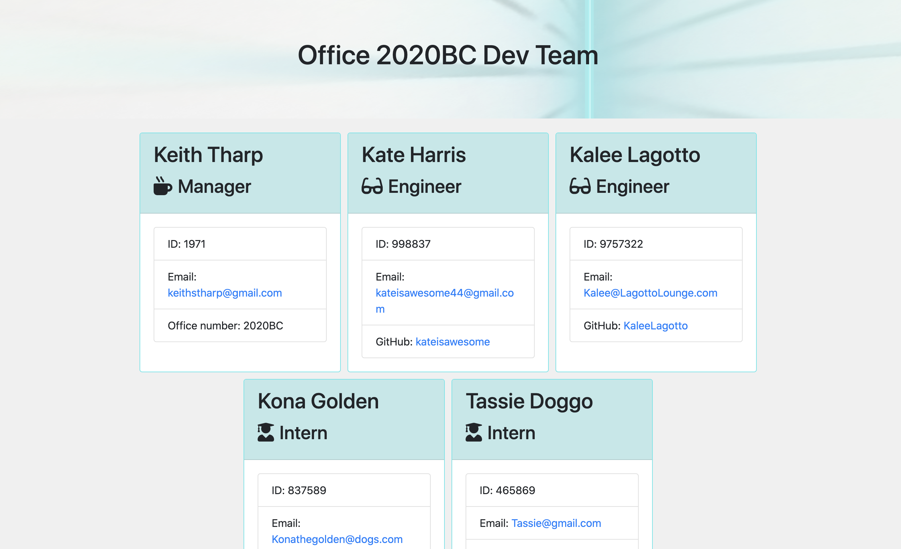

  
  # Employee Summary html Page Generator

  The Employee Summary html Page Generator is a simple CLI that provides prompts for a user to quickly answer questions about their engineering team to easily create an html page to display the team.

**View video of functioning app at -** https://youtu.be/suQlBWO06yQ

## Table of Contents
- [Installation](#Installation-instructions)
- [Usage](#How-to-use)
- [Contribute](#How-to-contribute)
- [Testing](#For-testing)
- [Questions](#Developed-by)
- [Credits](#Acknowledgments-and-Credits)
- [License](#Licensed-under-MIT)

## Installation instructions
The app can be downloaded from GitHub and saved in a convenient directory.

## How to use
The app is very easy to use. Launch from the command line using 'node app.js' then simply answer the resulting questions.

## How to contribute
If anyone would like to improve the app by contributing, they're welcome to submit a pull request on GitHub.

## For testing
Employee Summary html Page Generator can be tested with supplied tests by using 'npm run test' from the command line.

## Developed by
- Keith Tharp

Please reach out with questions at:
  - keithstharp@gmail.com

Find more of Keith Tharp's work at:
  - https://github.com/keiththarp

## Acknowledgments and Credits
Thank you to all my fellow students and study groups that helped and supported with this homework project!

## Licensed under MIT
[Click here for more information on the MIT license.](https://choosealicense.com/licenses/mit/)
